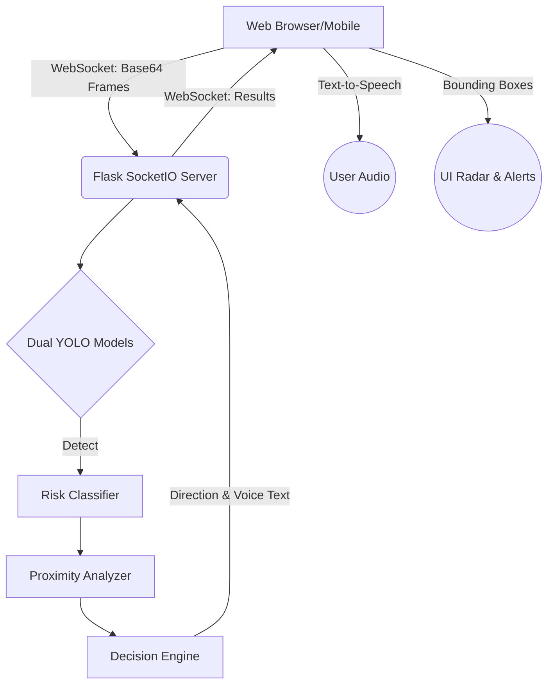

<div align="center">
  
  <h1>AI-ANSVI</h1>
  <p><strong>Design and development of an assistive navigation system for the visually impaired</strong></p>
  
  [](https://www.python.org/downloads/)
  [](https://github.com/ultralytics/ultralytics)
  [](https://vitejs.dev/)
  [](https://flask.palletsprojects.com/)
  [](https://opensource.org/licenses/MIT)
</div>

---

**Design and Development of an Assistive Navigation System for the Visually Impaired ** is a real-time object detection and audio guidance system designed to help visually impaired individuals navigate their surroundings safely. It utilizes deep learning to identify obstacles, assess their risk level based on proximity, and provide natural language voice directions via a highly responsive, modern web interface.

> [!WARNING]
> **Deployment & Accuracy Note:** This project relies on a powerful dual-model YOLO architecture running on the backend. The frontend is built with React/Vite. The system must be started via `run_web.py` to ensure the correct models and WebSocket handlers are active.

## ✨ Key Features

* **Real-time Object Detection:** Powered by a dual-model system using the YOLO architecture for exceptional accuracy and speed.
* **Intelligent Risk Assessment:** Maps the camera view into Left/Center/Right zones, analyzing proximity to determine risk levels (Low, Medium, High).
* **Voice Guidance (TTS):** Generates concise audio instructions (e.g., "Stop, chair ahead") and reads them out to the user automatically.
* **Modern React Frontend:** A newly rebuilt, ultra-responsive web interface powered by React, Vite, and Framer Motion for buttery-smooth animations.
* **Spatial Sonar Radar:** A beautiful 3D radar widget that pulses based on obstacle proximity and risk.

## 🏗️ Architecture



## 🚀 Getting Started

### Prerequisites
* Python 3.8+
* Node.js & npm (for building the frontend)
* A webcam (built-in, USB, or smartphone camera via network)

### Installation

1. **Clone the repository:**
   ```bash
   git clone https://github.com/Itachii0707/assistive_nav.git
   cd assistive_nav
   ```

2. **Setup Python Backend:**
   ```bash
   python -m venv .venv
   .venv\Scripts\activate  # Windows
   pip install -r requirements.txt
   ```

3. **Build the React Frontend:**
   ```bash
   cd web_ui
   npm install
   npm run build
   cd ..
   ```

## 🖥️ Usage

### Starting the Server
First, activate your virtual environment, then run the Flask server with the dual model configuration:

```powershell
.\.venv\Scripts\activate
python run_web.py --port 5000 --dual --model runs/detect/runs/train/combined_model_max/weights/best.pt
```

### Accessing the App
* **Local PC:** Open `http://localhost:5000`
* **Smartphone:** Ensure your phone is on the **same WiFi network**. Navigate to `http://<YOUR_IP_ADDRESS>:5000`.

*When prompted, allow Camera and Microphone permissions.*

## 📁 Project Structure

* `core/`: Backend logic (`detector.py`, `decision.py`, `proximity.py`).
* `web/`: Flask WebSocket server (`app.py`).
* `web_ui/`: Modern React + Vite frontend source code.
* `models/` & `runs/`: Stored YOLO weights (`.pt` files).

## 🤝 Contributing
Contributions are always welcome! Please fork this repository and create a Pull Request with your feature or bug fix.

## 📄 License
Distributed under the MIT License. See `LICENSE` for more information.
